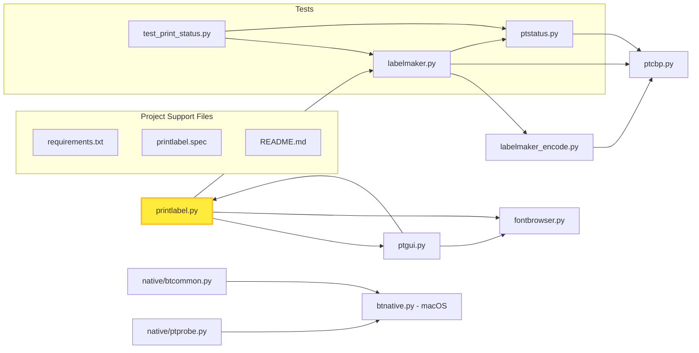

# Printing to a Brother P-Touch Cube PT-P300BT label printer from a computer

A Python-based label printing utility designed for Brother PT-P300BT thermal label printers. This program creates custom labels with text, images, and advanced formatting options, automatically optimizing content to fit within the printer's specifications.

It supports any TrueType and OpenType font, automatically selects the maximum font size to fit the printable area of the tape. Text strings including characters which do not [overshoot](https://en.wikipedia.org/wiki/Overshoot_(typography)) below the [baseline](https://en.wikipedia.org/wiki/Baseline_(typography)) (e.g., uppercase letters) are automatically printed with a bigger font. In addition, the program calculates the size of the printed tape and the print duration and processes images.

## Introduction

The [Brother P-touch Cube PT-P300BT labelling machine](https://support.brother.com/g/b/producttop.aspx?c=gb&lang=en&prod=p300bteuk) is intended to be controlled from the official Brother P-touch Design&Print 2 app for [Android](https://play.google.com/store/apps/details?id=com.brother.ptouch.designandprint2) and [iOS](https://apps.apple.com/it/app/brother-p-touch-design-print/id1105307806) devices.

This repository provides a pure-Python tool to print from a computer: a
command-line interface for scripted / batch printing and a full Tkinter
graphical interface (`--gui`) with a live 1:1 preview, a system font
browser and color emoji rendering in the text box.

## Features

### Text Rendering
- **Unicode Support**: Full UTF-8 character support with optional Unicode escape sequences
- **Custom Fonts**: Support for TrueType (.ttf) and OpenType (.otf) fonts
- **Automatic Font Sizing**: Intelligent font size optimization to fit the printable area
- **Multiline Text**: Support for multi-line labels with configurable line spacing
- **Text Styling**: Configurable fill colors, stroke effects, and text centering
- **Font Scaling**: Manual font size scaling with percentage-based adjustments
- **Emoji Support**: Emoji are rendered as raster overlays (in-line sized to their row, or filling the printable area with `--emoji-print-area`), shown in black & white by default (what actually prints) or in color with `--no-mono-emoji`
- **Uniform Font Sizing** (`--uniform-font`): measure a fixed sample ("Ag") so all labels with the same number of lines use the same font size
- **OpenType Features** (`--ligatures FEATURE`): apply a GSUB feature of the selected font (e.g. `calt` for the arrows in Fira Code, `liga`/`dlig`) via optional uharfbuzz shaping; `--list-ligatures` shows which features the font exposes
- **TAB Expansion** (`--tab-width`): expand TAB characters to a configurable number of spaces so they never print as a square box

### Image Processing
- **Image Integration**: Merge images with text labels
- **PDF Support**: Convert PDF files to images for printing
- **Smart Cropping**: Automatic cropping of white space around image content
- **Aspect Ratio Preservation**: Maintains image proportions while resizing
- **Multiple Image Merge**: Combine multiple images in a single label

### Label Customization
- **Flexible Sizing**: Custom horizontal text stretching to specified millimeter widths
- **Padding Control**: Adjustable horizontal padding and vertical positioning
- **End Margins**: Configurable end margins for label finishing
- **Auto-cutting**: Optional automatic cutting or label boundary marking
- **Chain Printing**: Disable feeding for continuous label chains
- **Configurable Tape Width** (`--tape-width`): plan the label for a smaller printable band (e.g. 6/9 mm) while keeping the 128 px raster compatible with the device (the hardware itself prints on 12 mm tape)

### Graphical Interface (--gui)
- **Tkinter GUI**: launch a full graphical front-end with `python printlabel.py --gui`
  - live preview of the label, matching the printed tape 1:1
  - color emoji rendering in the Text & Font input box
  - system font browser with per-font sample preview
  - all options exposed as controls (text, images, merge list, expert settings)
  - print confirmation dialog and error reporting
  - console progress messages are suppressed while the GUI is running

### Advanced Features
- **Line Spacing Optimization**: Automatic line spacing adjustment when text doesn't fit
- **Visual Guides**: Optional ruler lines and printable area indicators
- **Binary Conversion**: Optimized image processing with custom thresholding
- **Compression Control**: Optional compression disable for specific printing needs
- **Preview Mode**: View generated images before printing

## Usage

The program has two front-ends: a **command line** for scripted / batch
printing, and a **Tkinter GUI** (`--gui`) for interactive use with a live
1:1 preview, a system font browser and color emoji in the text box.

### CLI

Standard usage:

```
python3 printlabel.py COM_PORT FONT_NAME TEXT_TO_PRINT
```

- `COM_PORT`: printer port — `COM7` (Windows), `/dev/rfcomm0` (Linux) or `bt:NAME` for native Bluetooth (e.g. `bt:PT-P300`).
- `FONT_NAME`: TrueType/OpenType font file (optional, default `arial.ttf`).
- `TEXT_TO_PRINT`: text of the label (multiple arguments are joined with spaces; use the literal `\n` for line breaks).

### GUI

Launch the GUI:

```bash
python printlabel.py --gui
```

The GUI exposes all options as controls and suppresses console progress
messages while running. Tkinter is part of the Python standard library; on
Debian/Ubuntu install the OS package `python3-tk` if missing.

### Basic Text Label

```bash
python3 printlabel.py -sl COM7 "arial.ttf" "Lorem Ipsum"
```

or, using the packaged executable:

```
printlabel.exe COM7 "arial.ttf" "Lorem Ipsum"
```

(`-s` shows the generated image, `-l` adds rulers and print-area guides.)

### Multiline Text Label

Text is multiline when it contains the literal `\n` characters. The
`--line-spacing` option controls the spacing between lines (default 1.2,
i.e. 20% extra space); the font size is automatically calculated to fit
all lines within the printable area. `--center-text` horizontally centers
each single line:

```bash
python printlabel.py -sl COM3 arial.ttf "Line 1\nLine 2\nLine 3"
```

### Emoji

Emoji are rendered as raster overlays, in black & white by default (what
the 1-bit thermal printer actually prints); use `--no-mono-emoji` for the
embedded colors on screen:

```bash
python printlabel.py -sl COM7 "arial.ttf" "Hello 😀"
python printlabel.py -sl --no-mono-emoji COM7 "arial.ttf" "Hello 😀"
```

### OpenType features (ligatures)

With `uharfbuzz` installed, apply a GSUB feature of the selected font
(e.g. the arrows of Fira Code), without altering normal characters:

```bash
python printlabel.py --list-ligatures "Fira Code"       # see the available tags
python printlabel.py -sl --ligatures calt COM7 "Fira Code Regular Nerd Font.ttf" "ciao-->qui"
```

## Command Line Arguments

```
usage: printlabel.py [-h] [--list-bt] [--gui] [--fixed-width MILLIMETERS] [--fixed-font-size SIZE]
                     [-u] [-l] [-s] [-c] [-i FILE_NAME] [-M FILE_NAME] [-R FLOAT] [-X DOTS]
                     [-Y DOTS] [--merge-gap DOTS] [-S FILE_NAME] [--save-conv FILE_NAME] [-n] [-F]
                     [-a] [-m DOTS] [-r] [-C] [--fill-color FILL] [--stroke-fill STROKE_FILL]
                     [--stroke-width STROKE_WIDTH] [--text-size MILLIMETERS] [--font-scale NUMBER]
                     [--h-padding DOTS] [--v-shift DOTS] [-p MULTIPLIER] [-H]
                     [--tape-width MILLIMETERS] [--emoji-print-area] [--uniform-font]
                     [--ligatures FEATURE] [--list-ligatures [FONT_NAME]] [--luma-lo NUMBER]
                     [--luma-hi NUMBER] [--mono-emoji | --no-mono-emoji] [--tab-width SPACES]
                     [--white-level NUMBER] [--threshold NUMBER]
                     [COM_PORT] [FONT_NAME] [TEXT_TO_PRINT ...]
```

Required positional arguments

- `COM_PORT`: Serial port for printer communication (e.g., COM3, /dev/ttyUSB0, or `bt:NAME` for native Bluetooth)
- `FONT_NAME`: Path to TrueType or OpenType font file (optional, defaults to arial.ttf)
- `TEXT_TO_PRINT`: Text content for the label (supports multiple arguments)

Optional arguments:

```
  -h, --help            show this help message and exit
  --list-bt             List paired Bluetooth devices supporting RFCOMM/SPP and exit.
  --gui                 Launch the Tkinter GUI instead of printing from the command line.
                        COM_PORT/FONT_NAME/TEXT_TO_PRINT are ignored. The GUI has its own status
                        panel, so console progress messages are suppressed.
  --fixed-width MILLIMETERS
                        Pad label to exact width in mm (adds whitespace if text is shorter).
  --fixed-font-size SIZE
                        Use fixed font size (disables auto-sizing to fit printable area)
  -u, --unicode         Use Unicode escape sequences in TEXT_TO_PRINT.
  -l, --lines           Add horizontal lines for drawing area (dotted red) and tape (cyan).
  -s, --show            Show the created image. (If also using -n, terminate.)
  -c, --show-conv       Show the converted image. (If also using -n, terminate.)
  -i FILE_NAME, --image FILE_NAME
                        Image file to print. If this option is used (legacy mode), TEXT_TO_PRINT and
                        FONT_NAME are ignored.
  -M FILE_NAME, --merge FILE_NAME
                        Merge the image file before the text. Can be used multiple times.
  -R FLOAT, --resize FLOAT
                        With image merge, additionaly resize it (floating point number).
  -X DOTS, --x-merge DOTS
                        With image merge, shift right the image of X dots.
  -Y DOTS, --y-merge DOTS
                        With image merge, shift down the image of Y dots.
  --merge-gap DOTS      Horizontal gap (in dots) between a merged image and the text.
  -S FILE_NAME, --save FILE_NAME
                        Save the produced image to a PNG file.
  --save-conv FILE_NAME
                        Save the converted (rasterized) image sent to the printer to a PNG file.
  -n, --no-print        Only configure the printer and send the image but do not send print command.
  -F, --no-feed         Disable feeding at the end of the print (chaining).
  -a, --auto-cut        Enable auto-cutting (or print label boundary on e.g. PT-P300BT).
  -m DOTS, --end-margin DOTS
                        End margin (in dots).
  -r, --raw             Send the image to printer as-is without any pre-processing.
  -C, --nocomp          Disable compression.
  --fill-color FILL     Fill color for the text (e.g., "white"; default = "black").
  --stroke-fill STROKE_FILL
                        Stroke Fill color for the text (e.g., "black"; default = None).
  --stroke-width STROKE_WIDTH
                        Width of the text stroke (e.g., 1 or 2).
  --text-size MILLIMETERS
                        Horizontally stretch the text to fit the specified size.
  --font-scale NUMBER   Scale font size by specified percentage (default: 100%)
  --h-padding DOTS      Define custom left and right horizontal padding in pixels (default: 5 pixels
                        left and 5 pixels right)
  --v-shift DOTS        Define relative vertical traslation in pixels (default is to vertically
                        center the font)
  -p MULTIPLIER, --line-spacing MULTIPLIER
                        Line spacing multiplier for multi-line text (default: 1.2)
  -H, --center-text     Horizontally center text inside the label image.
  --tape-width MILLIMETERS
                        Printable tape width in mm (default: 12). The PT-P300BT prints on 12 mm tape
                        with a fixed raster; values below 12 (e.g. 6, 9) shrink the printable band
                        the text is auto-sized to, keeping the 128 px raster compatible with the
                        device.
  --emoji-print-area    Size emoji to fill the printable area (64 px, like merged images) instead of
                        their line height.
  --uniform-font        Use the same font size regardless of the specific text: the auto-fit
                        measures a standard sample ("Ag", covering ascents and descents) instead of
                        the actual letters. All texts with the same number of lines then get the
                        same size, e.g. "cao" and "ciao".
  --ligatures FEATURE   Enable a GSUB feature of the selected font (requires uharfbuzz). The feature
                        name is the OpenType tag, e.g. "calt" (contextual alternates, arrows in Fira
                        Code), "liga" (standard ligatures) or "dlig" (discretionary ligatures).
                        Repeat the option to enable several features. Text is shaped with HarfBuzz
                        but only the substituted (ligature) glyphs are drawn differently; all normal
                        characters stay exactly as they are. Use --list-ligatures to see the
                        features the font actually exposes.
  --list-ligatures [FONT_NAME]
                        List the OpenType GSUB features of the selected font and exit. Use a tag
                        from the list with --ligatures.
  --luma-lo NUMBER      Monochrome emoji cut: luminance below this value becomes solid black ink
                        (default: 140).
  --luma-hi NUMBER      Monochrome emoji cut: luminance above this value becomes transparent
                        (default: 175). Values between LO and HI fade with antialiasing.
  --mono-emoji, --no-mono-emoji
                        Render emoji as black ink (--mono-emoji, default) instead of in their
                        embedded colors (--no-mono-emoji). The thermal print is 1-bit, so mono
                        matches what actually prints. (default: True)
  --tab-width SPACES    Number of spaces a TAB character expands to (default: 8).
  --white-level NUMBER  Minimum pixel value to consider it "white" when cropping the image. Set it
                        to a value close to 255. (Default: 240)
  --threshold NUMBER    Custom thresholding when converting the image to binary, to manually decide
                        which pixel values become black or white (Default: 75)
```

## Usage details

Options `-sln` are useful to simulate the print, showing the created image and adding a ruler in inches and centimeters (magenta), with horizontal lines to mark the drawing area (dotted red) and the tape borders (cyan).

Before generating the text (`TEXT_TO_PRINT`), the tool allows concatenating images with the `-M` option; it can be used more times for multiple images (transparent images are also accepted). The final image can also be saved with the `-S` option and then reused by running again the tool with the `-M` option; when also setting `TEXT_TO_PRINT` to a null string (`""`), the reused image will remain unchanged. Merged images are automatically resized to fit the printable area, removing white borders without modifying the proportion. Resize and translation of merged images can also be manually controlled with `-R` (floating point number), `-X`, `-Y`. The `--text-size` option horizontally stretches or squeezes the text so that it fits the specified size in millimeters; the size parameter includes `--end-margin` and default left and right paddings, but does not include the size of merged images if used, which have a fixed length that has to be kept proportioned. The `font-scale` allows specifying a percentage to scale the font size, maintaining the aspect ratio; font sizes > 100 are accepted even if potentially causing overflow. `--h-padding` and `--v-shift` allow horizontally and vertically translating the text (using `--h-padding` with `--end-margin` enables separately cointrolling left and right margins; specifically `--h-padding` uses the same value for the left and right parts, while `--end-margin` will be a relative value applied to the right `--h-padding`).

`-i` runs the legacy process of *labelmaker.py* and disables image processing.

## Further examples

Example of merging image and text, automatically resizing and translating the image so that it fits the printable area:

```bash
curl https://raw.githubusercontent.com/uroesch/pngpetite/main/samples/pngpetite/happy-sun.png -o resources/happy-sun.png
python printlabel.py -sl -M resources/happy-sun.png COM7 "Gabriola.ttf" "Hello!"
```

Same as before, but uses the PDF version of happy-sun (it is designed for single page PDFs, like barcodes or other custom icons)

```bash
curl https://raw.githubusercontent.com/uroesch/pngpetite/main/samples/pngpetite/happy-sun.png -o resources/happy-sun.png
python printlabel.py -sl -M resources/happy-sun.pdf COM7 "Gabriola.ttf" "Hello!"
```

Same as the happy-sun.png example, but resizing the text so that its length is about 7 centimeters plus heading image, with a small white border at the end:

```bash
python printlabel.py -sl -M resources/happy-sun.png COM7 --text-size 70 --end-margin 10 "micross.ttf" "lorem ipsum dolor sit amet"
```

Examples of usage of Unicode escape sequences:

```bash
python printlabel.py -slnu COM7 "calibri.ttf" "\u2469Note"
```

```bash
python printlabel.py -sl -u COM3 arial.ttf "Caf\u00e9"
```

Examples of using text stroke:

```bash
python printlabel.py -sln --stroke-width 2 -m 10 COM7 "arial.ttf" "Bolded text"
python printlabel.py -sln --stroke-width 1 --fill-color="white" --stroke-fill="black" -m 10 COM7 "Gabriola.ttf" "Text stroke"
```

## Installation

```
git clone https://github.com/Ircama/PT-P300BT && cd PT-P300BT
pip install -r requirements.txt
```

## Web application (browser port)

A complete browser port of the program lives in the [`web/`](web/) folder.
It re-implements the label algorithms and the GUI 1:1 in HTML/CSS/JavaScript
and prints to the PT-P300BT directly from the browser over Bluetooth using
the **Web Serial API** (Bluetooth Classic RFCOMM/SPP) — no OS serial port or
Python installation required.

### Running it

Serve the folder over HTTP (Web Serial requires a secure context; `file://`
works for the preview but not for the serial port):

```bash
cd web
python -m http.server 8000
# then open http://localhost:8000/ in Chrome or Edge
```

### Browser support

| Browser | Preview & algorithms | Bluetooth printing |
| --- | --- | --- |
| Chrome / Edge (desktop, 117+) | ✅ | ✅ (Web Serial + RFCOMM/SPP) |
| Chrome on Android | ✅ | ✅ |
| Firefox | ✅ | ❌ (no Web Serial) |
| Safari (macOS/iOS) | ✅ | ❌ (no Web Serial) |

When the browser does not expose the Web Serial API, the page shows an
informative banner explaining that printing is unavailable and which
browsers to use; the preview and every label algorithm keep working.

### Feature parity

The web port mirrors `printlabel.py`:

- **Algorithms** (`web/label.js`): auto-fit font sizing, multiline layout,
  uniform font sizing, emoji raster overlay (in-line and print-area band),
  luminance-based black & white emoji, image merge/crop/resize, fixed width,
  text stretching, rulers, and the rotate/invert/mirror/threshold/128-px-pad
  rasterization.
- **OpenType features** (`--ligatures`): applied through SVG
  `font-feature-settings`, which Chrome/Edge shape with HarfBuzz — the same
  engine `uharfbuzz` wraps in the Python version.
- **Protocol** (`web/printer.js`): the PTCBP command set, PackBits RLE
  compression, status-register parsing and the full print job flow.
- **GUI** (`web/index.html`, `web/app.js`): every control of the Tkinter GUI
  (text, font, ligatures, TAB width, advanced tuning, images/merge, printer
  options, preview zoom/pan, converted-raster view, save PNG, print).

### Tests

```bash
node web/test_printer.mjs   # protocol + print flow (40 tests)
node web/test_label.mjs     # label algorithms (35 tests, needs `npm i canvas`)
node web/test_web.mjs       # end-to-end GUI in Chrome + WebKit (45 tests)
```

The browser test (`test_web.mjs`) drives the real page with Playwright: it
checks the preview, every control, zoom, the converted-raster view,
ligatures, emoji, multiline, uniform font, fixed width, save PNG, the print
guard, image merge, the full print flow with a mocked serial port, and the
"unsupported browser" banner (verified with WebKit, which has no Web Serial).
It needs a local server (`npm run serve`) and `npx playwright install chrome webkit`.

## Code dependency structure



- **`printlabel.py`** — CLI entry point and the label builder: font auto-fit,
  emoji raster overlay, GSUB feature shaping (`--ligatures`), image merge;
  launches the Tkinter GUI with `--gui` and lists fonts via `fontbrowser.py`.
- **`ptgui.py`** — Tkinter GUI front-end (live preview, system font browser,
  all options exposed as controls); imported lazily by `printlabel --gui`.
- **`labelmaker.py`** — printer communication: device setup, raster transfer,
  `do_print_job()` and `wait_for_print_completion()` status polling loop.
- **`labelmaker_encode.py`** — raster encoding (TIFF/RLE compression) and
  `read_png()` binary conversion for the printer protocol.
- **`ptcbp.py`** — Brother P-Touch command building blocks (commands,
  serialization, status query); shared by encoder, status and printer layers.
- **`ptstatus.py`** — 32-byte status register ctypes layout, `unpack_status()`,
  flag descriptions and pretty printing of printer status replies.
- **`fontbrowser.py`** — cross-platform system font discovery (feeds the GUI
  dropdown and `--list-ligatures`).
- **`native/`** — native transport layer: `btcommon.py` selects the platform
  backend (Windows SPP / macOS IOBluetooth via `btnative.py` / Linux rfcomm);
  `ptprobe.py` is a macOS-only Bluetooth probe helper.
- **`test_print_status.py`** — unit tests for the status polling: layout size,
  wait-for-completion, timeout restore, battery / power-off failures.

## Bluetooth printer connection on Windows

The following steps allow connecting a Windows COM port to the Bluetooth printer.

- Open Windows Settings
- Go to Bluetooth & devices
- Press "View more devices"
- Press "More Bluetooth settings"
- Select "COM Ports" tab
- Press Add... (wait for a while)
- Select Outgoing
- Press Browse...
- Search for PT-P300BT9000 and select it
- Select PT-P300BT9000
- Service: Serial
- Read the name of the COM port
- Press OK
- Press OK

Perform the device pairing.

## Windows Bluetooth Quirk
- As [pytouch-cube](https://github.com/piksel/pytouch-cube) says, for the Brother Cube
  PT-300BT Label Maker:
  > After connecting to the device it will automatically disconnect again.
  - Windows says "Driver Unavailable"
  - But if you simply run the program (under PowerShell), it will work

## Usage on WSL

Pair the printer with an RFCOMM COM port using the Windows Bluetooth panel.

Check the outgoing RFCOMM COM port number and use it to define /dev/ttyS_serial_port_number; for instance, COM5 is /dev/ttyS5.

Usage: `python3 printlabel.py /dev/ttyS_serial_port_number FONT_NAME TEXT_TO_PRINT`

## Bluetooth printer connection on Ubuntu

Connect the printer via [Ubuntu Bluetooth panel](https://help.ubuntu.com/stable/ubuntu-help/bluetooth-connect-device.html.en) (e.g., Settings, Bluetooth).

To read the MAC address: `hcitool scan`. Setup /dev/rfcomm0.

Usage: `python3 printlabel.py /dev/rfcomm0 FONT_NAME TEXT_TO_PRINT`

## Creating an executable asset for the GUI

To build an executable file via [pyinstaller](https://pyinstaller.org/en/stable/), first install *pyinstaller* with `pip install pyinstaller`.

The *printlabel.spec* file helps building the executable program. Run it with the following command.

```
pip install pyinstaller  # if not yet installed
pyinstaller printlabel.spec
```

Then run the executable file created in the *dist/* folder.

This repository includes a Windows *printlabel.exe* executable file which is automatically generated by a [GitHub Action](https://github.com/Ircama/PT-P300BT/blob/main/.github/workflows/build.yml). It is packaged in a ZIP file named *printlabel.zip* and uploaded into the [Releases](https://github.com/Ircama/PT-P300BT/releases/latest) folder.

## Notes

The printer has 180 DPI (dot per inch) square resolution at 20 mm/sec.

The max. length of the printable area is 0,499 m.

Even if the Brother TZe tape size is 12 mm, the height of the printable area is 64 pixels, which is 9 mm at 180 DPI: 64 pixels / 180 DPI / 0.0393701 inch/mm = 9 mm.

On this printer, tape is wasted before and after the printable area on each label (about 2.5 cm of additional tape before the printed area and about 1 mm after it).

## History

This repository is based on the scripts included in the following Gists:

- [PT-P300BT Gist](https://gist.github.com/Ircama/bd53c77c98ecd3d7db340c0398b22d8a)
- [dogtopus/Pipfile Gist](https://gist.github.com/dogtopus/64ae743825e42f2bb8ec79cea7ad2057)
- [stecman Gist](https://gist.github.com/stecman/ee1fd9a8b1b6f0fdd170ee87ba2ddafd)
- [vsigler Gist](https://gist.github.com/vsigler/98eafaf8cdf2374669e590328164f5fc)

The scripts convert text labels to appropriate images (including the first page of a PDF conversion with "pdf2image" and which requires poppler to be installed) compatible with 12mm width craft tapes like [TZe-131](https://www.brother-usa.com/products/tze131) or [TZe-231](https://www.brother-usa.com/products/tze231), tuned for the max allowed character size with this printer, regardless the used font. The scripts also include the code to drive the printer via serial Bluetooth interface.

Comparing this repository with the PT-P300BT Gist, the Python *printlabel.py* program has been introduced, replacing *printlabel.cmd* and *printlabel.sh* with several enhancements; it avoids creating temporary image files, provides more accurate image processing and does not rely on ImageMagick. In addition, all options included in the original *labelmaker.py* module are available, with several extensions.

## Other resources

- https://github.com/piksel/pytouch-cube
- https://github.com/probonopd/ptouch-770
- https://github.com/kacpi2442/labelmaker

## Acknowledgments

[stecman](https://gist.github.com/stecman) and his [Gist](https://gist.github.com/stecman/ee1fd9a8b1b6f0fdd170ee87ba2ddafd).
